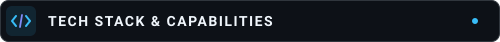
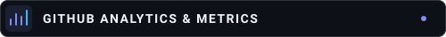
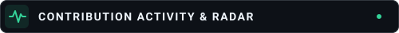
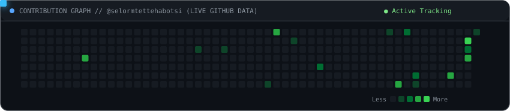
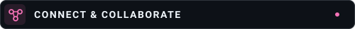

  <!-- HERO BANNER (PURE ANIMATED SVG) -->
  

   

  <!-- DYNAMIC TYPING SVG -->
  

   
  
    

  <!-- ANIMATED VECTOR TERMINAL -->
  

    
  
    

  <!-- TECH STACK SECTION -->
  
    

  <!-- CATEGORIZED SKILL ICONS (PURE SVGs) -->
  

    
  

  

    
  

  

    
  

  

    
  

  

    
  

   
  
    

  <!-- GITHUB METRICS SECTION -->
  
    

  <!-- STATS & STREAKS DYNAMIC SVGs -->
  

    
    
  

  

    
  

   
  
    

  <!-- CONTRIBUTION ACTIVITY SECTION -->
  
    

  <!-- NATIVE ANIMATED REAL-TIME ACTIVITY WAVE -->
  

    
  

  <!-- NATIVE ANIMATED CONTRIBUTION SNAKE -->
  

    
  

   
  
    

  <!-- CONNECT & COLLABORATE SECTION -->
  
    

  

    
    &nbsp;
    
    &nbsp;
    
  

   

  

    
  

   
  

